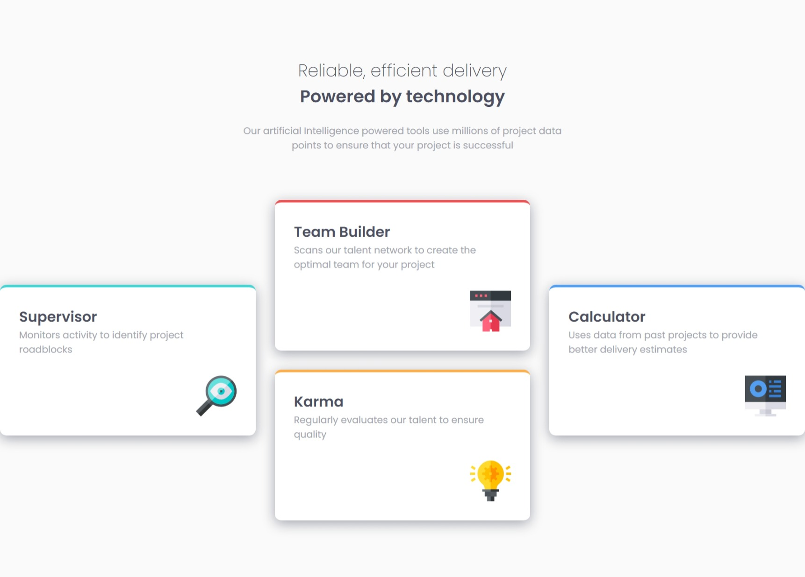
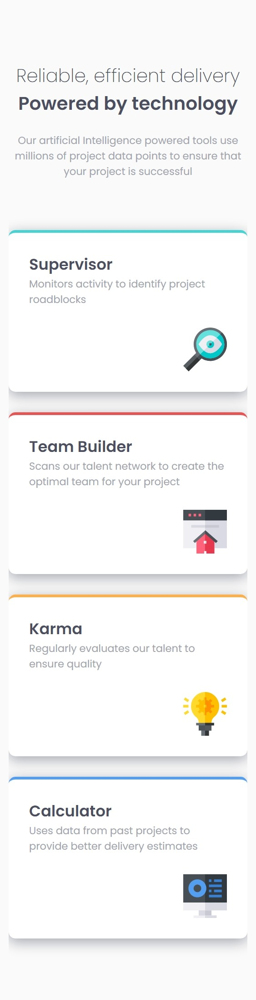

This is a solution to the [Four card feature section challenge on Frontend Mentor](https://www.frontendmentor.io/challenges/four-card-feature-section-weK1eFYK). Frontend Mentor challenges help you improve your coding skills by building realistic projects. 


- [Overview](#overview)
  - [The challenge](#the-challenge)
  - [Screenshot](#screenshot)
  - [Links](#links)
- [My process](#my-process)
  - [Built with](#built-with)
  - [What I learned](#what-i-learned)
  - [Continued development](#continued-development)
  - [Useful resources](#useful-resources)
- [Author](#author)


### The challenge

Users should be able to:

- View the optimal layout for the site depending on their device's screen size

___
### Screenshot

Desktop Screenshot


Mobile Screenshot


___
### Links

-  [Solution URL](https://github.com/HadjerL/frontend-mentor-four-card-feature.git)
-  [Live Site URL](https://frolicking-swan-c6967c.netlify.app/)


### Built with

- Semantic HTML5 markup
- CSS custom properties
- Flexbox
- CSS Grid
- Mobile-first workflow
___

### What I learned

This is the best fun I had working on a project. I have learned how to do some animations, thought it's been tricky a bit. I have tried to make smooth and enjoyable. I am also working on making my code cleaner by writing more comment and ordering everything in a logical way.

To see how you can add code snippets, see below:

```html
 <div class="card">
          <div>
            <h2>Team Builder</h2>
            <p>Scans our talent network to create the optimal team for your project</p>
          </div>
          <div class="icon">
            
          </div>
        </div>
```
```css
.card{
    background-color:var(--white);
    display: flex;
    flex-direction: column;
    gap: 2rem;
    padding: 2rem;
    border-radius: 10px;
    box-shadow: var(--Grayish-Blue) 0px 5px 20px;
    cursor: pointer;
}
.card:first-of-type{
    transform: translateX(150%) translateY(-20px);
    border-top: 4px solid var(--Cyan);
    animation: right-cards-animation 700ms ease-in-out 1 forwards;
}
@keyframes right-cards-animation {
    0%{
        transform: translate(150%, -20px);
    }
    100%{
        transform: translate(0);
    }
}
```
___
### Continued development

The next step I am going for is to learn and master Javascript in order to make even better animations. I believe for that I am getting books that's gonna help me with that. As for this solution I need to fix the overflow caused by translating the cards

___
### Useful resources

- [CSS animation](https://youtu.be/cfq7u52lvfI) - This helped me for it's simple and wholesome. This guy is really awsome.


- Frontend Mentor - [@HadjerL](https://www.frontendmentor.io/profile/HadjerL)
